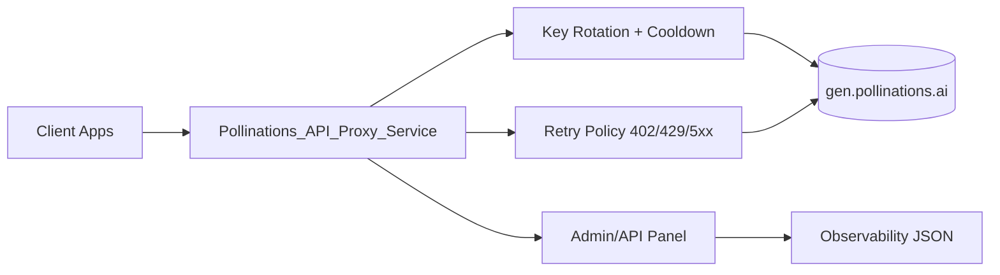
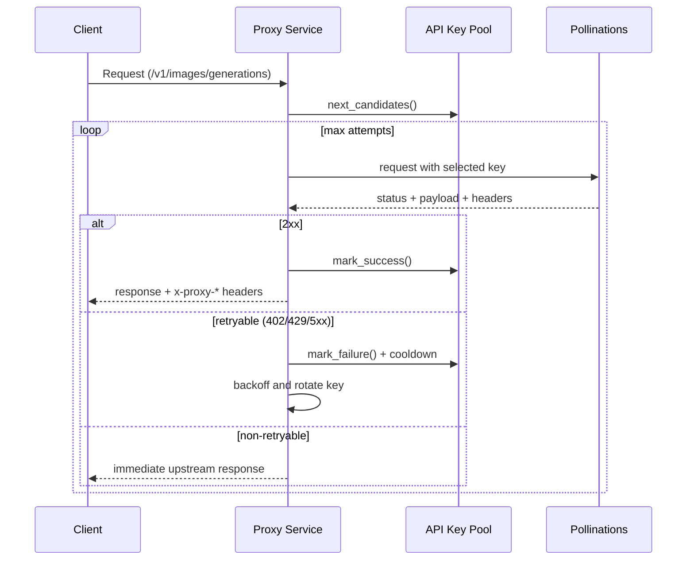

# Pollinations_API_Proxy_Service

Production-ready FastAPI proxy for Pollinations image APIs with key rotation, failover retries, admin diagnostics, and OpenAI-compatible image routes.

## Overview

- Upstream: `https://gen.pollinations.ai`
- Runtime: `FastAPI` + `httpx` async client
- Key strategy: round-robin pool with cooldown on failures
- Compatibility: OpenAI-style image generation endpoint (`/v1/images/generations`)
- Admin/API panel: key health, last rate-limit snapshot, and effective runtime config

## Architecture



## Request Lifecycle



## Features

- Multi-key API rotation with per-key cooldown
- Automatic retries on configurable statuses (`402`, `429`, `500`, `502`, `503`, `504` by default)
- Optional forced outbound proxy (`:2080` / SOCKS5)
- OpenAI-compatible image generation API
- Pollinations URL-style image generation passthrough
- Admin/API panel endpoints for runtime introspection
- Model list caching with configurable TTL

## Quick Start

```bash
python3 -m pip install -r requirements.txt
cp .env.example .env
python3 -m uvicorn api.app.main:app --host 0.0.0.0 --port 8000
```

Docs (if enabled):
- `http://127.0.0.1:8000/docs`
- `http://127.0.0.1:8000/redoc`
- `http://127.0.0.1:8000/openapi.json`

## Environment Configuration

Minimum required:

```env
POLLINATIONS_API_KEYS=sk_key_1,sk_key_2
# or:
# POLLINATIONS_API_KEY=sk_single_key
```

Recommended admin hardening:

```env
ADMIN_ENABLED=true
ADMIN_REQUIRE_TOKEN=true
ADMIN_TOKEN=replace_with_strong_token
ADMIN_HEADER_NAME=x-admin-token
```

Proxy routing (optional):

```env
POLLINATIONS_USE_PROXY_2080=true
POLLINATIONS_PROXY_2080_URL=socks5://127.0.0.1:2080
POLLINATIONS_TRUST_ENV_PROXY=false
```

## API Catalog

### Public Endpoints

| Method | Path | Purpose | Auth | Notes |
|---|---|---|---|---|
| `GET` | `/health` | Service health and runtime basics | None | Returns default model, key pool size, proxy toggle |
| `GET` | `/image/models` | Pollinations image model catalog | None | Supports `?refresh=true` |
| `GET` | `/image/models/free` | Free image-capable models | None | Filters by `paid_only=false` and `output_modalities` contains `image` |
| `GET` | `/v1/models` | OpenAI-style model list passthrough | None | Adds `_proxied_at`; supports `?refresh=true` |
| `POST` | `/v1/images/generations` | OpenAI-compatible image generation | None | Injects default fields if omitted |
| `POST` | `/v1/images/edits` | Image edit passthrough | None | Supports multipart/json passthrough |
| `GET` | `/image/{prompt}` | Pollinations direct image endpoint | None | Returns image bytes or JSON error |
| `GET` | `/v1/probe/free-image` | Probe with a free model | None | Useful for upstream smoke testing |

### Admin/API Panel Endpoints

| Method | Path | Purpose | Auth Required |
|---|---|---|---|
| `GET` | `/v1/keys/status` | Per-key runtime metrics (success/failure/cooldown/latency) | `x-admin-token` when enabled |
| `GET` | `/v1/rate-limit/last` | Last captured upstream rate-limit headers | `x-admin-token` when enabled |
| `GET` | `/v1/config/effective` | Effective merged runtime config (masked secrets) | `x-admin-token` when enabled |

Admin auth behavior:
- If `ADMIN_ENABLED=false`, admin endpoints return `404`.
- If `ADMIN_REQUIRE_TOKEN=true`, requests must include `x-admin-token` (or configured `ADMIN_HEADER_NAME`).

## Endpoint Usage Examples

### Health

```bash
curl -s http://127.0.0.1:8000/health | jq
```

### OpenAI-Compatible Image Generation

```bash
curl -s http://127.0.0.1:8000/v1/images/generations \
  -H 'Content-Type: application/json' \
  -d '{
    "model": "flux",
    "prompt": "a cyberpunk cat in Tehran, cinematic",
    "size": "1024x1024",
    "quality": "medium",
    "response_format": "b64_json"
  }' | jq
```

### Pollinations URL Style

```bash
curl -L -o out.png "http://127.0.0.1:8000/image/spider%20man%20inside%20iran%20flag?model=flux&width=1024&height=1024"
```

### List Free Models

```bash
curl -s "http://127.0.0.1:8000/image/models/free?refresh=true" | jq '.count, .models[].name'
```

### Admin: Key Status

```bash
curl -s http://127.0.0.1:8000/v1/keys/status \
  -H 'x-admin-token: replace_with_strong_token' | jq
```

### Admin: Effective Config

```bash
curl -s http://127.0.0.1:8000/v1/config/effective \
  -H 'x-admin-token: replace_with_strong_token' | jq
```

## Proxy Headers Returned to Clients

The proxy adds runtime diagnostics to responses:

- `x-request-id`: request correlation id
- `x-proxy-served-by`: fixed service identifier
- `x-proxy-attempts`: number of attempts used
- `x-proxy-key-slot`: key slot that served final attempt
- `x-proxy-key-rotated`: `true/false`
- Rate-limit headers when available (example: `x-ratelimit-*`, `retry-after`)

## Benchmark Script

Run two prompts across two models and save outputs:

```bash
python3 scripts/benchmark_models.py --base-url http://127.0.0.1:8000 --models flux,gptimage
```

Generated files:
- Images: `artifacts/images/*.png`
- Report: `artifacts/benchmarks/benchmark_<unix_ts>.json`

## Project Structure

```text
api/app/main.py         # FastAPI routes
api/app/services.py     # proxy core, retries, key rotation, caching
api/app/config.py       # env + yaml config loader
api/app/schemas.py      # response/request models
scripts/                # helper CLI scripts
tests/                  # config/service tests
```

## GitHub Remote

```bash
git remote add origin https://github.com/AliBalash/Pollinations_API_Proxy_Service.git
```

